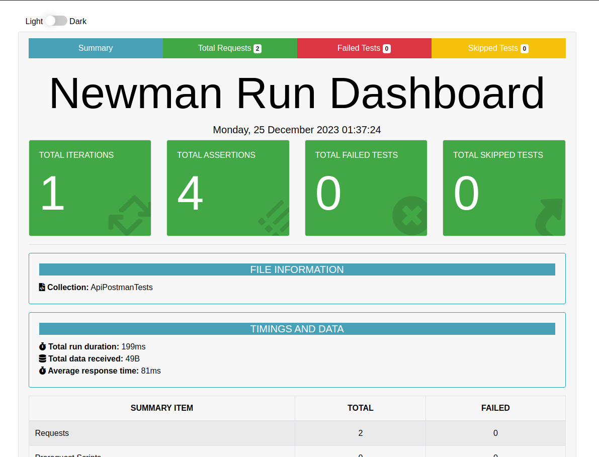
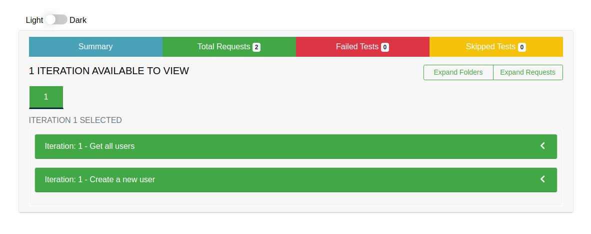
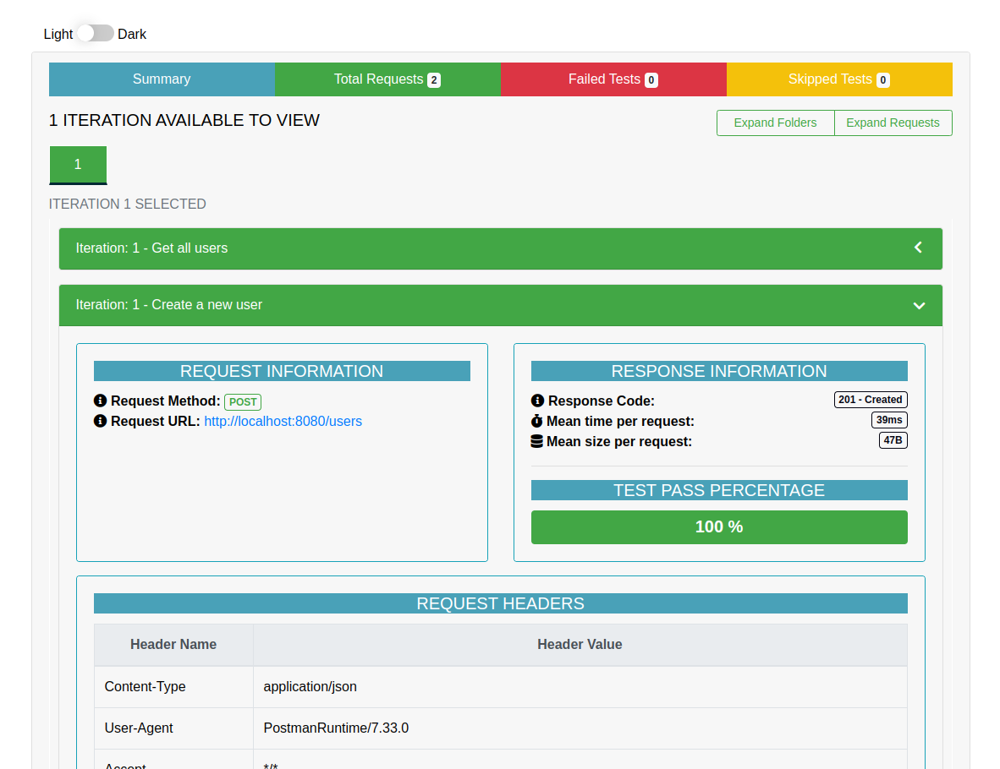

# Api Newman tests

### Summary
Implementation with postman tests and newman execution for CI/CD

#### Executing application
```
mvn spring-boot:run
```

#### Install newman
```
npm install -g newman
```

#### Install newman reporters
```
npm install -g newman-reporter-htmlextra
```

#### Executing test by newman
Obs.: Export postman test before
```
newman run "ApiPostmanTests.postman_collection.json"
```

#### Executing test by newman with reporters
Obs.: Export postman test before
```
newman run "ApiPostmanTests.postman_collection.json" -r htmlextra --reporter-htmlextra-displayProgressBar 
```

Newman reporter example:





